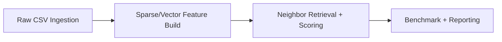

# Hybrid Inference Engine

Hybrid recommender system built on MovieLens data, designed to demonstrate production-style data pipelines, low-memory inference, and benchmark-driven model governance.

For data engineering and quant-facing roles, this repository emphasizes:

- Streaming data processing over large CSVs.
- Deterministic artifact generation (`.npz`, memmap, index mapping).
- Repeatable offline evaluation with latency and ranking metrics.
- Regression gates suitable for CI/CD-style quality control.

## Why This Project Matters

- **Data Engineering:** chunked ingestion, schema-aware typing, sparse matrix artifacts, and reproducible pipelines.
- **Quant Research:** measurable ranking quality (`Precision@K`, `Recall@K`, `NDCG@K`) plus latency distribution tracking (`p50/p95/p99`).
- **MLOps Mindset:** benchmark checkpointing, run-over-run deltas, and pass/fail gates.

## Pipeline Summary

1. Build a sparse movie-tag relevance matrix from `genome-scores.csv`.
2. Build user preference vectors from historical ratings and tag relevance.
3. Retrieve nearest-neighbor users and rank candidate movies.
4. Evaluate quality and latency at benchmark checkpoints.
5. Generate a markdown report with regression gates.

## Runtime Behaviors

- Notebook data loading now supports:
  - auto-detecting dataset folders (`ml-latest`, `ml-latest-small`, `data/...`, parent dirs),
  - `MOVIELENS_DIR` environment override,
  - optional auto-download of MovieLens (`MOVIELENS_AUTO_DOWNLOAD=1`, default enabled).
- `evaluate_model.py` now defaults paths relative to this repository and can auto-rebuild `movie_tags.npz` from CSVs when missing.
- User preference matrix creation uses `rust_bridge.py` with a Python fallback when an older Rust extension build is loaded.

## Architecture



- **Ingestion:** chunked pandas readers with explicit dtypes to bound memory and improve parse consistency.
- **Feature Build:** `scipy.sparse` for movie-tag relevance and `numpy.memmap` for user preference storage.
- **Inference/Eval:** brute-force cosine KNN over user vectors, checkpointed benchmarking, and regression reporting.

## Project Structure

- `Movie_Recommendation_System.ipynb`: Main notebook for loading data, preprocessing, building matrices, and running the interactive recommender UI.
- `evaluate_model.py`: Offline evaluator for the recommender in ultra-low-memory mode.
- `benchmark_report.py`: Generates markdown benchmark summary with run-to-run deltas and pass/fail quality/latency gates.
- `run_benchmark_pipeline.py`: One-command runner that executes benchmark evaluation and report generation.
- `rust_bridge.py`: Python bridge for Rust-backed helpers with fallback behavior.
- `rust_ext/`: Rust extension source (`Cargo.toml`, `src/lib.rs`) for optional acceleration.
- `ml-latest/`: MovieLens dataset folder (`ratings.csv`, `movies.csv`, `genome-scores.csv`, etc.).
- `movie_tags.npz`: Sparse movie-tag matrix artifact used by notebook/scripts.
- `users_preferences.dat`: User preference memmap artifact.
- `user_index_to_id.npy`: User-id index artifact.

## Data Contract

Expected dataset files:

- `ratings.csv`
- `movies.csv`
- `genome-scores.csv`
- `genome-tags.csv`

Core generated artifacts:

- `movie_tags.npz`
- `users_preferences.dat`
- `user_index_to_id.npy`
- `benchmark_results.csv`
- `benchmark_report.md`

## Requirements

- Python 3.10+
- Core Python packages:
  - numpy
  - pandas
  - scipy
  - scikit-learn
  - matplotlib
  - ipywidgets
  - jupyter

## Setup

From the repository root:

```bash
python3 -m venv .venv
source .venv/bin/activate
pip install --upgrade pip
pip install numpy pandas scipy scikit-learn matplotlib ipywidgets jupyter
```

Place or unzip MovieLens data under:

- `./ml-latest/`

Optional environment overrides:

- `MOVIELENS_DIR=/path/to/ml-latest`
- `MOVIELENS_AUTO_DOWNLOAD=0` (disable notebook auto-download)

## Quickstart

### 1. Build Artifacts in Notebook

Open `Movie_Recommendation_System.ipynb` and run cells from top to bottom.

This generates/refreshes key artifacts used by scripts, including `users_preferences.dat` and `user_index_to_id.npy`.

### 2. Run Offline Evaluation

```bash
python3 evaluate_model.py
```

If `movie_tags.npz` does not exist, the script will rebuild it automatically from the dataset CSV files.

Common options:

```bash
python3 evaluate_model.py \
  --data-dir ./ml-latest \
  --movie-tags ./movie_tags.npz \
  --prefs ./users_preferences.dat \
  --user-index ./user_index_to_id.npy \
  --sample-users 500 \
  --k-neighbors 25
```

### 3. Run Checkpointed Benchmarks

This records ranking and latency metrics at each user-count checkpoint.

```bash
python3 evaluate_model.py \
  --data-dir ./ml-latest \
  --movie-tags ./movie_tags.npz \
  --prefs ./users_preferences.dat \
  --user-index ./user_index_to_id.npy \
  --sample-users 600 \
  --benchmark-step 150 \
  --k-neighbors 25 \
  --results-path ./benchmark_results.csv
```

Tracked per checkpoint (`150, 300, 450, ...`):

- Precision@5/10/20
- Recall@5/10/20
- NDCG@5/10/20
- Latency percentiles (`p50`, `p95`, `p99`) in milliseconds

### 4. Generate Regression Report

```bash
python3 benchmark_report.py \
  --results-path ./benchmark_results.csv \
  --output-md ./benchmark_report.md \
  --max-p95-ms 150 \
  --max-p99-ms 250 \
  --max-recall10-drop-pct 5 \
  --max-ndcg10-drop-pct 5
```

### 5. One-Command Pipeline

```bash
python3 run_benchmark_pipeline.py \
  --data-dir ./ml-latest \
  --movie-tags ./movie_tags.npz \
  --prefs ./users_preferences.dat \
  --user-index ./user_index_to_id.npy \
  --sample-users 600 \
  --benchmark-step 150 \
  --results-path ./benchmark_results.csv \
  --report-path ./benchmark_report.md
```

## Quant and DE Signals

Use these points in interviews or portfolio writeups:

- Built a reproducible recommender research pipeline with explicit artifacts and typed data contracts.
- Added robust fallback logic for missing inputs (dataset resolution, auto-download, artifact rebuild).
- Implemented checkpointed benchmark logging for time-series model governance.
- Included regression gating for both quality drift and latency SLO-style controls.
- Used out-of-core and sparse strategies to keep memory usage bounded on commodity hardware.

## Performance Notes

- The notebook has low-memory switches for constrained machines.
- The scripts are chunked and designed to avoid loading the full ratings table in memory.
